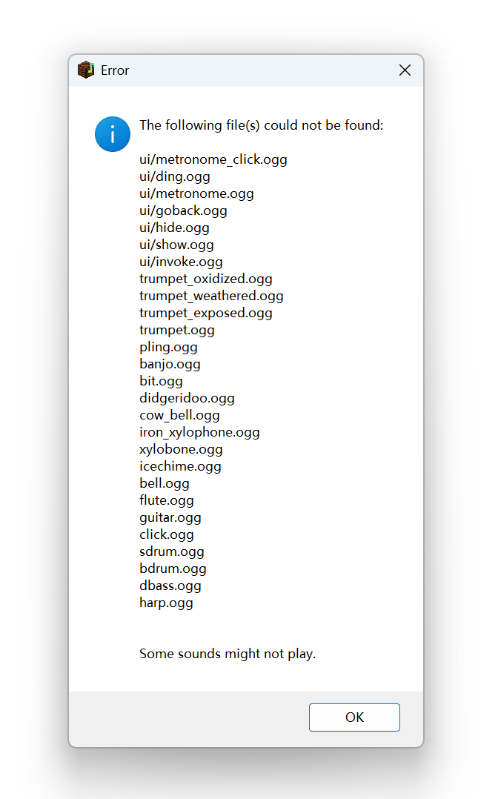

# NBS-ANSI-APPDATA-Fix

<p align="center"></img></p>

临时修复因 Windows 用户名为中文导致的 NBS 无法读入音频资源文件的问题

Temporarily fix the problem of NBS while using non-ascii user names that cannot correctly load audio files, under Windows.

## 使用方法 | Usage

1.  请确认你使用最新版本的 [Minecraft Open Note Block Studio](https://github.com/OpenNBS/NoteBlockStudio/tree/development)

    Please confirm that you are using the latest version of [Minecraft Open Note Block Studio](https://github.com/OpenNBS/NoteBlockStudio/tree/development)

2.  请确认你出现的错误过程应该是：

    The error process should be as follows:

    1.  连续多次弹出错误提示框，每个都说某个 `.ogg` 文件无法找到

        Multiple error message boxes are popped up, each indicating that an `.ogg` file cannot be found.
    
    2.  最后弹出以下错误弹窗

        Finally a pop-up error window appears:

        </img>
    
    3.  其他 NBS 功能大致完好，但是没有声音。

        Other NBS functions are generally intact, but there is no sound.


3.  请从[发布页](https://github.com/EillesWan/NBS-ANSI-APPDATA-Fix/releases/latest)下载本程序，并直接双击运行。

    Please download this program from the [release page](https://github.com/EillesWan/NBS-ANSI-APPDATA-Fix/releases/latest), and simply double click the executable to run, then everything should be fine.


## 版权声明 | License

本脚本依照 [Apcache 2.0 开源协议](./LICENSE)发布

This script is released under the [Apache 2.0 License](./LICENSE)

```
Copyright © 2026 金羿Eilles

Licensed under the Apache License, Version 2.0 (the "License");
you may not use this file except in compliance with the License.
You may obtain a copy of the License at

    http://www.apache.org/licenses/LICENSE-2.0

Unless required by applicable law or agreed to in writing, software
distributed under the License is distributed on an "AS IS" BASIS,
WITHOUT WARRANTIES OR CONDITIONS OF ANY KIND, either express or implied.
See the License for the specific language governing permissions and
limitations under the License.
```